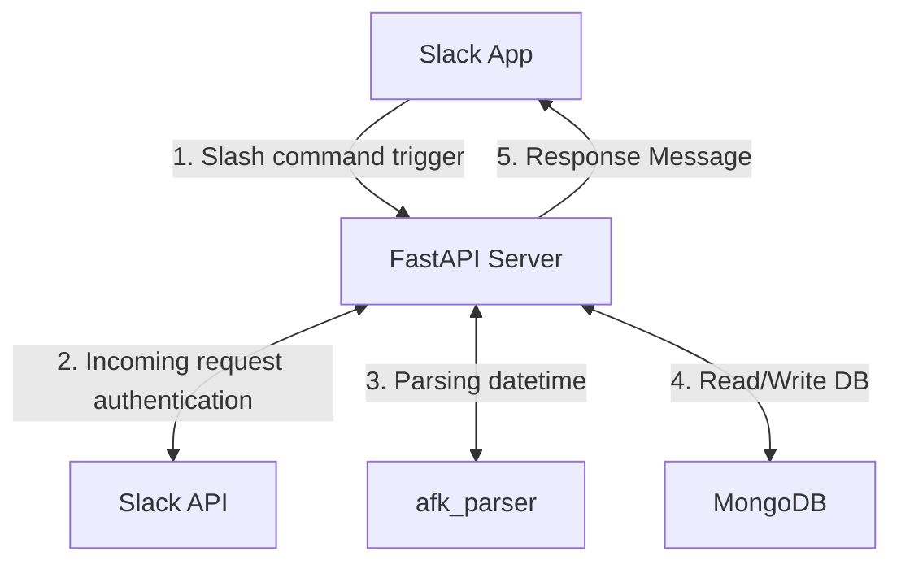
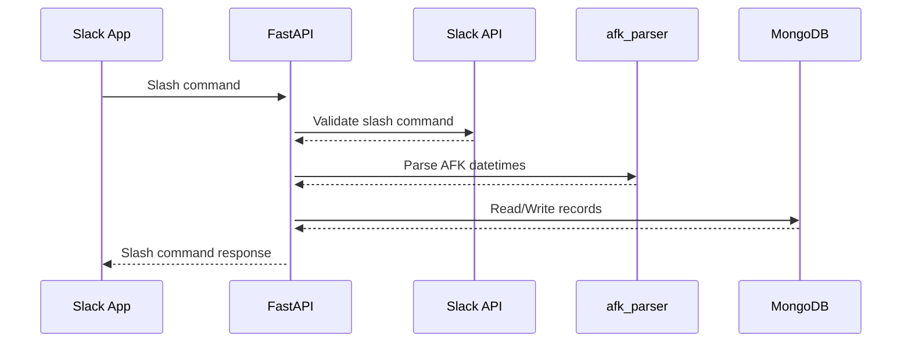

# AFKbot

## Flow Chart

## Sequence Diagram

## Appreciations

- [fastapi](https://github.com/fastapi/fastapi)
- [localtunnel](https://github.com/localtunnel/localtunnel)
- [motor](https://github.com/mongodb/motor)
- [ngrok](https://github.com/ngrok)
- [parsedatetime](https://github.com/bear/parsedatetime)
- [pydantic](https://github.com/pydantic/pydantic)
- [slack](https://github.com/slackhq)
- [uvicorn](https://github.com/encode/uvicorn)
