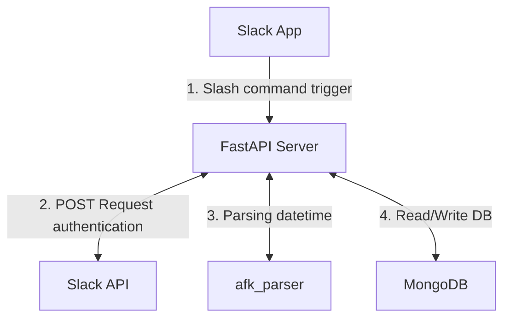

# AFKbot

## Request Flow

## Appreciations

- [fastapi](https://github.com/fastapi/fastapi)
- [localtunnel](https://github.com/localtunnel/localtunnel)
- [parsedatetime](https://github.com/bear/parsedatetime)
- [pydantic](https://github.com/pydantic/pydantic)
